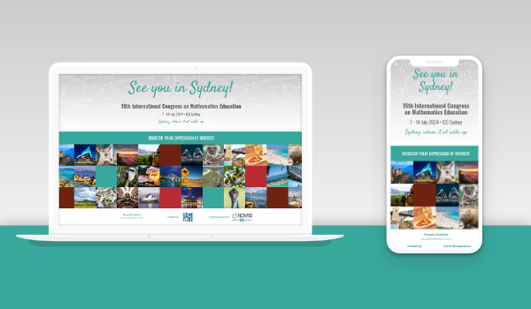
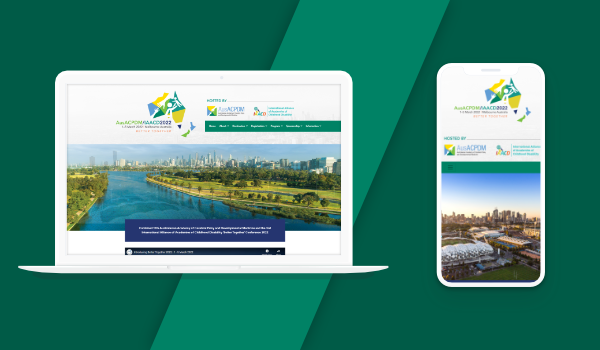
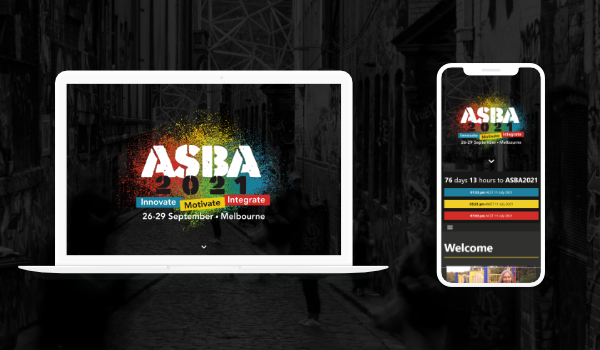
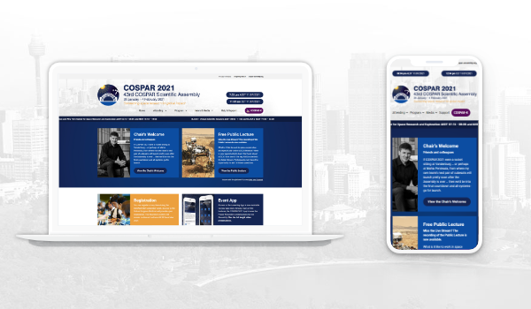
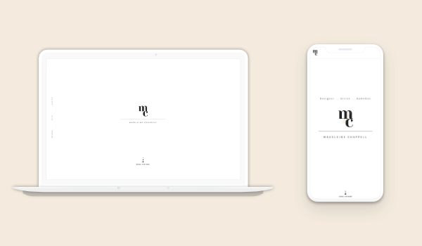

  

    

      
      <a href="https://icme15.com/" target="_blank" class="project-content">
        
Website

        <h1 class="mb-1">ICME15</h1>
        <h2>ICMS Australasia</h2>
      </a>
    

    

      
      <a href="https://bettertogether2022.org/" target="_blank" class="project-content">
        
Website

        <h1 class="mb-1">Better Together 2022</h1>
        <h2>ICMS Australasia</h2>
      </a>
    

    

      
      <a href="https://asba2021.com.au/" target="_blank" class="project-content">
        
Website

        <h1 class="mb-1">ASBA2021</h1>
        <h2>ICMS Australasia</h2>
      </a>
    

    

      
      <a href="https://cospar2021.org/" target="_blank" class="project-content">
        
Website

        <h1 class="mb-1">COSPAR2021</h1>
        <h2>ICMS Australasia</h2>
      </a>
    

    

      
      <a href="https://mchappellart.github.io/" target="_blank" class="project-content">
        
Website

        <h1 class="mb-1">Madeleine Chappell Portfolio</h1>
        <h2>ICMS Australasia</h2>
      </a>
    

    

      

      

        
p5.js

        <h1 class="mb-1">Daily Cycle</h1>
        <h2>Personal</h2>
      

    

    <!-- 

      
      <a href="" class="project-content">
        
p5.js

        <h1 class="mb-1">Amber Rain</h1>
        <h2>Twitch.tv</h2>
      </a>
    

    

      
      <a href="" class="project-content">
        
p5.js

        <h1 class="mb-1">Watercolor</h1>
        <h2>Personal</h2>
      </a>
    
 -->
  

